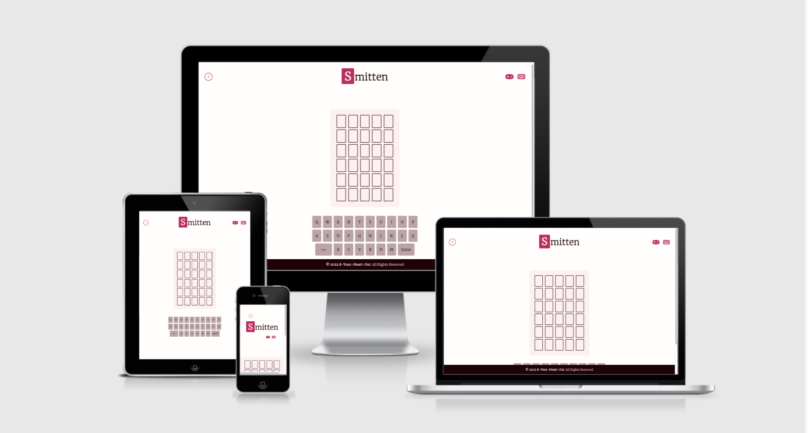

# Smitten

[Smitten](https://alissatroiano.github.io/8-your-heart-out/index.html) is an online word game related to love and Valentine's Day. Smitten was inspired by the famous game, [Wordle](https://www.nytimes.com/games/wordle/index.html). The game is built for anyone who likes word games, and want to test their knowledge in love.

The rules are simple: The player must guess the hidden word of 5 characters in 6 tries. First of all, type any love word on the first line and see if there's a match. You will get a match and the tile will turn red if the letter is guessed correctly and is in the right spot. If the letter is in the word, but in the wrong position, will become pink.  And the tile will become silver if the letter doesn't match the place and isn't in the word.

## Table of Contents

- [Smitten](#smitten)
  - [Table of Contents](#table-of-contents)
  - [UX](#ux)
    - [Features](#features)
    - [strategy-table](#strategy-table)
    - [colour theory](#colour-theory)
    - [Wireframes](#wireframes)
  - [Technologies Used](#technologies-used)
  - [Testing](#testing)
    - [Navigation:](#navigation)
    - [Game Functionality Test 1: Handling Clicks:](#game-functionality-test-1-handling-clicks)
    - [Game Functionality Test 2: Handling Clicks](#game-functionality-test-2-handling-clicks)
    - [Game Functionality Test 3: Applying Styles To Pressed Keys](#game-functionality-test-3-applying-styles-to-pressed-keys)
    - [Game Functionality Test 4: Applying Styles To Pressed Keys](#game-functionality-test-4-applying-styles-to-pressed-keys)
    - [W3C Jigsaw CSS Test:](#w3c-jigsaw-css-test)
    - [W3C HTML Test:](#w3c-html-test)
    - [Google Lighthouse Test #1: Performance:](#google-lighthouse-test-1-performance)
  - [Deployment](#deployment)
  - [CREDITS](#credits)
  - [ACKNOWLEDGEMENTS](#acknowledgements)

## UX

### Features

Navigation bar

- The navigation bar is present on all three pages to maintain uniformity.
- The navigation bar is fully responsive.
- It includes the logo, the game page and the developer page.
- On the game page only you can find Directions: A Bootstrap modal with text content about how to play, so users understand how   to play the game.
- It's easy to navigate on every page, there is no need to use the 'back' button.

Smitten: The game itself. [Game](https://alissatroiano.github.io/8-your-heart-out/)

- The game page contains the actual game.
- It's represented by a container with six rows of five fields each for the amount
  of letters for the word that needs to be guessed.
- The 6 rows make it clear a person has only 6 guesses to find the correct word.
- Right underneath it, is the keyboard which is used to fill in the letters, it's easy to use because it represents a regular keyboard.

Footer

- The footer section includes an all rights reserved and the name of the developers group, 8-your-heart-out.
- The footer will be shown throughout all pages to maintain uniformity.

Developers: The page that shows the developers of the game and their contact information. [Developer Page](https://alissatroiano.github.io/8-your-heart-out/developer-page.html)

- The developer page contains 6 cards with each a photo and information about the collaborators on this project.
- At the bottom of each card are links presented to both Github and Linkedin for easy connection.

### strategy-table

### colour theory 
The classic colors related to love and Valentine's Day are red and white. Red represents deep passion and respect for your loved ones, and invites us to action, motivates us, this color represents a perfect match for Valentine's Day. White stands for a new beginning. If you blend the two colors, you get the pink color that represents playfulness and that is the color of first love. And to represent detached and neutral emotions is gray.

Therefore, these colors have been implemented in the game Smitten. Representing a true match for the letter in the hidden word and in the correct spot, is the color: red rose; getting the correct letter, but not in the right spot is represented by the light-pink; the silver-pink shows that we don't have a match, it isn't in the hidden word or in the right spot. Finally, porcelain color is a new opportunity to know whether you get a match or not.

### Wireframes

All wireframes were created with Balsamiq wireframing software and can be viewed entirely in this document.

## Technologies Used

This project makes use of the following languages, frameworks, and libraries:

- [HTML5](https://developer.mozilla.org/en-US/docs/Glossary/HTML5)

- [CSS3](https://developer.mozilla.org/en-US/docs/Web/CSS)
  
- [JavaScript](https://developer.mozilla.org/en-US/docs/Web/JavaScript)

- [Git]s(https://git-scm.com/doc)
  
- [GitHub Pages](https://pages.github.com/)

- [Google Fonts](https://fonts.google.com/)

- [Bootstrap 5](https://getbootstrap.com/docs/5.1/)

- [Google Lighthouse](https://developers.google.com/web/tools/lighthouse)

- [GitPod](https://gitpod.io/)

- [Balsamiq](https://balsamiq.com/)

- [W3C Jigsaw Validator](https://jigsaw.w3.org/css-validator/)

- [W3C HTML Validator](https://validator.w3.org/)

- [JS Hint](https://jshint.com/)

- [jQuery](https://api.jquery.com/)

## Testing

The following tests have been conducted by the [development team](https://github.com/alissatroiano/8-your-heart-out). Each test described below was accompanied by the actions taken to ensure the tests passed.

### Navigation:
  1. Visited the website's navigation bar.
  2. Clicked each link.
  3. Verified links bring users to the proper section.
  4. Repeated steps 1-3 on mobile and tablet.

### Game Functionality Test 1: Handling Clicks:
   1. Visited the game page on desktop & mobile browsers.
   2. Open the *JavaScript console* to review the word.
   3. Click on each key on the keyboard to generate a letter.
   4. Notice the data from the keys are not rendering in the game-container as expected.
   5. Observe a "TypeError" message when clicking the keys.
   6. Visit the `script.js` file to review the code.
   7. Refactor the code.
   8. Reload browser window and repeat steps 2-3.
   9. Observe how the data (letters) from the keys are now rendering in the game container as expected.
   10. Confirm keyboard button clicks are being handled correctly.
   11. Mark test passed.
### Game Functionality Test 2: Handling Clicks
   1. Visited the game page on desktop & mobile browsers.
   2. Click on each key on the keyboard to generate a letter.
   3. Observe how the letter of the key clicked renders in the corresponding tile im the game container.
   4. Confirm keyboard button clicks are being handled correctly.
   5. Mark test passed.
### Game Functionality Test 3: Applying Styles To Pressed Keys
  1. Visited the game page in a browser.
  2. Open the *JavaScript console* to review the word.
  3. Add letters that are included in the word to the game container.
  4. Press Enter.
  5. Ensure that the letters are highlighted in light pink in both the game & keyboard container.
  6. Add letters that are not included in the word to the game container.
  7. Observe that these letters are highlighted in light grey in both the game & keyboard container.
  8. Add letters that are included in the word (and in the correct spot) to the game container.
  9. Observe that these letters are highlighted in bright pink in both the game & keyboard container.
  10. Refactor and resolve bugs as needed.
  11. Mark test passed
### Game Functionality Test 4: Applying Styles To Pressed Keys
  1. Visited the game page in a browser.
  2. Add letters that may be included in the word to the game container.
  3. Press Enter.
  4. Observe highlighted keys in key and game container.
  5. Add another word.
  6. Press Enter.
  7. Notice that previously styled keys in the keyboard are overwritten incorrectly.
  8. Visit `script.js` to review the code.
  9. Observe an extra `return` statement in the `colorKeyboard()` function on line `124`.
  10. Delete the extra `return` statement.
  11. Repeat steps 1-6.
  12. Observer that the bug is resolved.
  13. Mark test passed.
### W3C Jigsaw CSS Test:
  1. Visited [W3C HTML Validator](https://validator.w3.org/nu/#textarea).
  2. Uploaded the entire stylesheet.
  3. Made all changes.
  4. Ran test again to verify all CSS passed.
  5. Repeated steps 1-4 again after repairing styles.

### W3C HTML Test:
 1. Visited [W3C HTML Validator](https://validator.w3.org/nu/#textarea).
 2. Pasted all contents of `index.html`.
 3. Made all corrections to repair errors.
 4. Ran test again to verify all HTML passed tests.
 5. Repeated steps 1-4 after each update.

### Google Lighthouse Test #1: Performance:
  1. Visited the game page in a browser.
  2. Open the *JavaScript console* and visit Google Lighthouse tab.
  3. Observe test results.
  4. Notice the score for performance is lower than anticipated.
  5. Visit images directory and compress files.
  6. Submit changes and repeat steps 1-3.
  7. Observe that the score is now much higher.
  8. Mark test passed.
## Deployment

**Continuous Deployment** practices via [GitHub Pages](https://pages.github.com/) has been implemented for this project.

[Smitten](https://alissatroiano.github.io/8-your-heart-out/index.html) was deployed to its' live production server during the early stages of development, and any changes to the codebase were tested and validated before being pushed to the production server.

The steps our team took to deploy are listed below:

1. In the GitHub repository, navigate to the Settings tab
2. From the source section drop-down menu, select the `main` branch
3. Once the `main` branch has been selected, click "Save"
4. GitHub will display a message confirming that the site has been deployed successfully
5. GitHub will provide a link to the deployed site
6. Click on the link to view the site has deployed in a new tab

The live link to our deployed project can be found here: [Smitten](https://alissatroiano.github.io/8-your-heart-out/index.html)

## CREDITS

- The **JavaScript logic** that makes Smitten work like a [Wordle](https://www.nytimes.com/games/wordle/index.html) game was learned from [Ani Kubow's YouTube video](https://www.youtube.com/watch?v=mpby4HiElek) and altered for this project by the development team.

- The fonts in the site were copied from [Google Fonts](https://fonts.google.com/)

- Deployment description comes from [Code Institute](https://github.com/Code-Institute-Solutions/readme-template)

- [GitHub Pages](https://pages.github.com/) was used to deploy the project.

- [Git](https://git-scm.com/doc) - was used for version control

## ACKNOWLEDGEMENTS

- This game was built for [Code Institute's February 2022 'Love is in the Air' Hackathon](https://hackathon.codeinstitute.net/hackathon/public/17/)

- This game was inspired by the newly famous game, [Wordle](https://www.nytimes.com/games/wordle/index.html)
