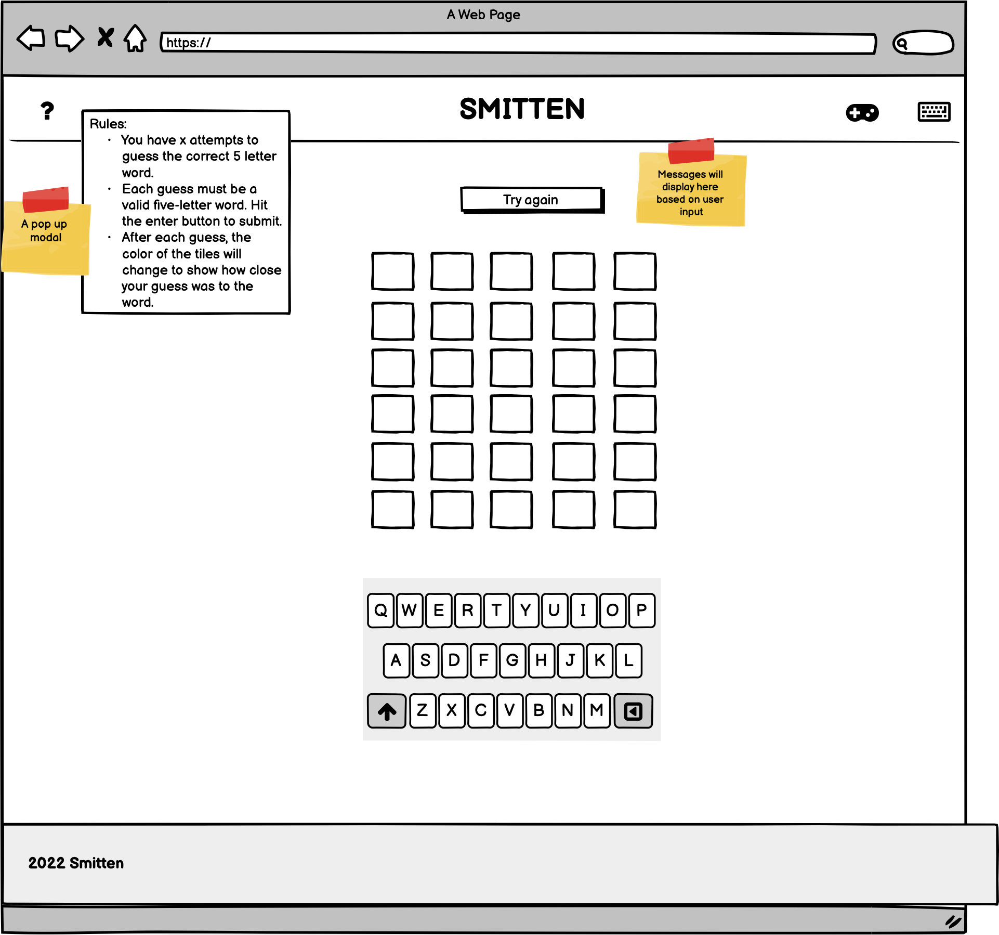

# Smitten

[Smitten](https://alissatroiano.github.io/8-your-heart-out/index.html) is an online word game related to love and Valentine's Day. Smitten was inspired by the trending "Wordle Game". The game is built for anyone who likes word games, and want to test their knowledge in love.

The rules are simple: The player must guess the hidden word of 5 characters in 6 tries. First of all, type any love word on the first line and see if there's a match. You will get a match and the tile will turn red if the letter is guessed correctly and is in the right spot. If the letter is in the word, but in the wrong position, will become pink.  And the tile will become silver if the letter doesn't match the place and isn't in the word.

## Table of Contents

- [Smitten](#smitten)
  - [Table of Contents](#table-of-contents)
  - [UX](#ux)
    - [Features](#features)
    - [strategy-table](#strategy-table)
    - [colour theary](#colour-theary)
    - [Wireframes](#wireframes)
  - [Technologies Used](#technologies-used)
    - [Tools](#tools)
    - [Languages Used](#languages-used)
    - [Libraries and Programs Used](#libraries-and-programs-used)
  - [Deployment](#deployment)
  - [CREDITS](#credits)
  - [ACKNOWLEDGEMENTS](#acknowledgements)

## UX

### Features

Navigation bar

- The navigation bar is present on all three pages to maintain uniformity.
- The navigation bar is fully responsive.
- It includes the logo, the game page and the developer page.
- On the game page only you can find Directions: A Bootstrap modal with text content about how to play, so users understand how   to play the game.
- It's easy to navigate on every page, there is no need to use the 'back' button.

Smitten: The game itself. [Game](https://alissatroiano.github.io/8-your-heart-out/)

- The game page contains the actual game.
- It's represented by a container with six rows of five fields each for the amount
  of letters for the word that needs to be guessed.
- The 6 rows make it clear a person has only 6 guesses to find the correct word.
- Right underneath it, is the keyboard which is used to fill in the letters, it's easy to use because it represents a regular keyboard.

Footer

- The footer section includes an all rights reserved and the name of the developers group, 8-your-heart-out.
- The footer will be shown throughout all pages to maintain uniformity.

Developers: The page that shows the developers of the game and their contact information. [Developer Page](https://alissatroiano.github.io/8-your-heart-out/developer-page.html)

- The developer page contains 6 cards with each a photo and information about the collaborators on this project.
- At the bottom of each card are links presented to both Github and Linkedin for easy connection.

### strategy-table

### colour theary

The classic colors related to love and Valentine's Day are red and white. Red represents deep passion and respect for your loved ones, and invites us to action, motivates us, this color represents a perfect match for Valentine's Day. White stands for a new beginning. If you blend the two colors, you get the pink color that represents playfulness and that is the color of first love. And to represent detached and neutral emotions is gray.

Therefore, these colors have been implemented in the game Smitten. Representing a true match for the letter in the hidden word and in the correct spot, is the color: red rose; getting the correct letter, but not in the right spot is represented by the light-pink; the silver-pink shows that we don't have a match, it isn't in the hidden word or in the right spot. Finally, porcelain color is a new opportunity to know whether you get a match or not.

### Wireframes

All wireframes were created with Balsamiq wireframing software and can be viewed entirely in this document.

## Technologies Used

### Tools

- [W3c Validator](https://validator.w3.org/)
- [Jigsaw Validator](https://jigsaw.w3.org/css-validator/)
- [JSHint](https://jshint.com/)
- [Lighthouse](https://chrome.google.com/webstore/detail/lighthouse/blipmdconlkpinefehnmjammfjpmpbjk?hl=es)
- [TinyPNG](https://tinypng.com/)
- [Fontawsome](https://fontawesome.com/)
- [Bootstrap](https://bootstrap-vue.org/)
- [Google Fonts](https://fonts.google.com/)
- [Coolors](https://coolors.co/)
- [Toolness](https://toolness.github.io/accessible-color-matrix/)

### Languages Used

- [HTML5](https://developer.mozilla.org/en-US/docs/Glossary/HTML5)
- [CSS3](https://developer.mozilla.org/en-US/docs/Web/CSS)
- [JavaScript](https://developer.mozilla.org/en-US/docs/Web/JavaScript)

HTML was used for the website/app and allows the game to be viewed.
CSS and bootsrap to style the html and javascript.
Javascript was used to create the logic for the game.

### Libraries and Programs Used

- rapid api(<https://rapidapi.com/ajith/api/love-calculator/details>)

rapid api was used for the logic for the game allow us to match the two peoples names.

## Deployment

**Continuous Deployment** practices via [GitHub Pages](https://pages.github.com/) has been implemented for this project.

[Smitten](https://alissatroiano.github.io/8-your-heart-out/index.html) was deployed to its' live production server during the early stages of development, and any changes to the codebase were tested and validated before being pushed to the production server.

The steps our team took to deploy are listed below:

1. In the GitHub repository, navigate to the Settings tab
2. From the source section drop-down menu, select the `main` branch
3. Once the `main` branch has been selected, click "Save"
4. GitHub will display a message confirming that the site has been deployed successfully
5. GitHub will provide a link to the deployed site
6. Click on the link to view the site has deployed in a new tab

The live link to our deployed project can be found here: [Smitten](https://alissatroiano.github.io/8-your-heart-out/index.html)

## CREDITS

- The JavaScript logic for the game was learned from [Ani Kubow's YouTube video](https://www.youtube.com/watch?v=mpby4HiElek) and altered for this project by the development team.

- The fonts in the site were copied from [Google Fonts](https://fonts.google.com/)
  
- [Rapid API](https://rapidapi.com/) was used to find the **matchmaking API** for the game.

- Deployment description comes from [Code Institute](https://github.com/Code-Institute-Solutions/readme-template)

- [GitHub Pages](https://pages.github.com/) was used to deploy the project.

## ACKNOWLEDGEMENTS

- This game was built for [Code Institute's February 2022 'Love is in the Air' Hackathon](https://hackathon.codeinstitute.net/hackathon/public/17/)
